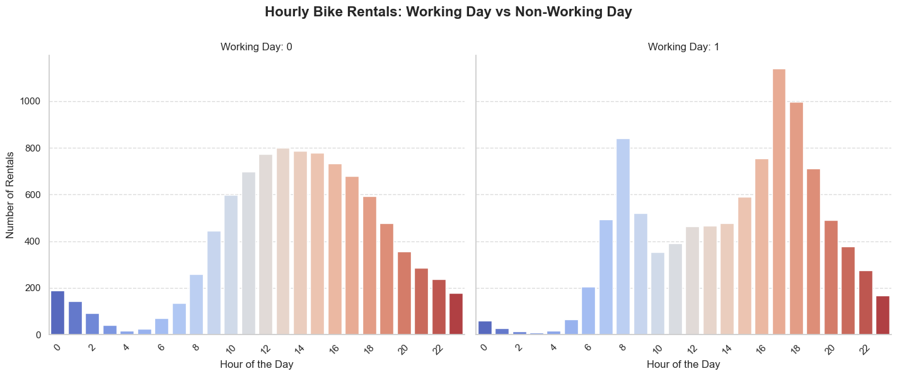
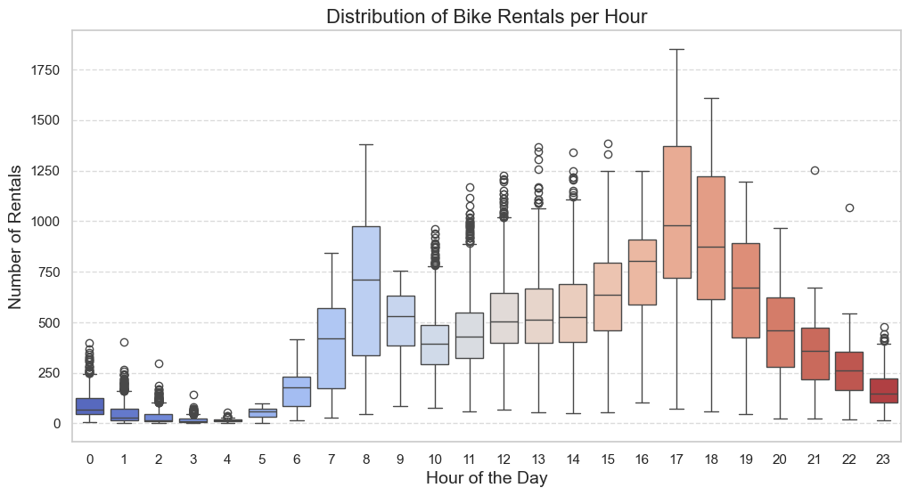
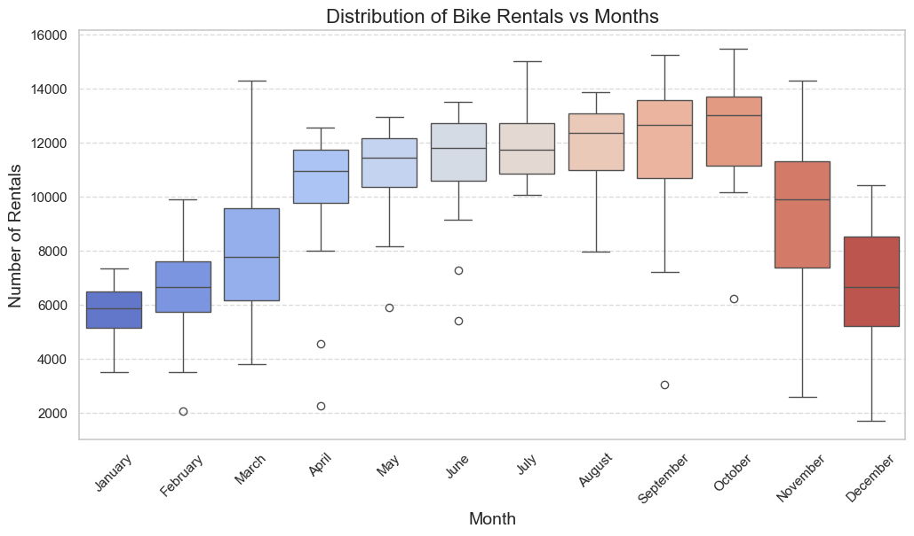
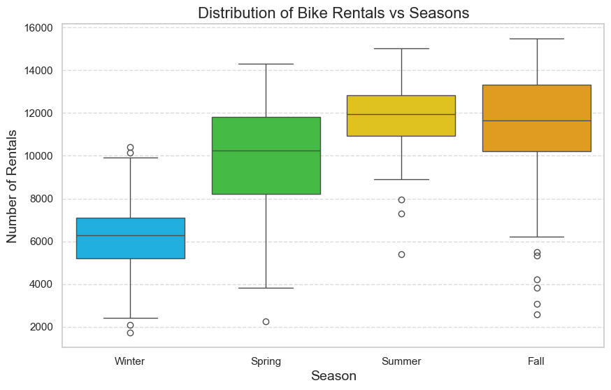

# **Urban Bike-Sharing: A Spatio-Temporal Analysis of Washington, DC**  

## **Overview**  
This project analyzes Washington, DC’s bike-sharing system using spatio-temporal models to identify demand patterns and optimize urban mobility. By integrating bike rental data with weather and temporal variables, it evaluates the impact of external factors on usage and compares predictive models. Developed as part of the course [**Statistics for High Dimensional Data and CompstatLab**](https://unibg.coursecatalogue.cineca.it/insegnamenti/2024/8244_43632_21827/2021/8244/89?coorte=2023&schemaid=77316) (Master’s in Computer Engineering).  

## **Objectives**  
- Investigate how weather and time variables influence bike-sharing demand.  
- Compare **Dynamic Coregionalization Model (DCM)** and **Hidden Dynamic Geostatistical Model (HDGM)** for predictive accuracy.  
- Propose data-driven strategies to optimize bike allocation and service efficiency.  

## **Methodology**  
- **Data Preprocessing & EDA**: Cleaned and analyzed data using **Python** (Pandas, NumPy, Matplotlib/Seaborn).  
- **Modeling**:  
  - **DCM**: Hierarchical model capturing spatial-temporal dependencies.  
  - **HDGM**: Latent process model for dynamic geospatial patterns.  
- **Tools**: Implemented in **MATLAB (D-STEM v2)** for modeling, validated via cross-validation.  

### Data Exploration
  
*Figure 2: Hourly bike rental patterns showing peak commuting times*
  -   
    *Figure 3: Distribution of rentals across hours of the day*
  -   
    *Figure 4: Monthly usage variations across 2023*
  -   
    *Figure 5: Comparative demand across seasons*

## **Key Findings**  
- **Temperature, precipitation, and UV index** are key demand predictors.  
- Longer trips on weekends/holidays reflect recreational vs. commuting use.  

## **Future Work**  
Expand with socio-demographic data, real-time traffic integration, and multi-year analysis.  

## **References**  
- Finazzi, F., Wang, Y., & Fassò, A. (2021). [D-STEM v2](https://www.jstatsoft.org/index.php/jss/article/view/v099i10). *Journal of Statistical Software*, 99(10).  
- [Capital Bikeshare Data](https://capitalbikeshare.com/system-data) | [Visual Crossing Weather](https://www.visualcrossing.com/weather-data)  
